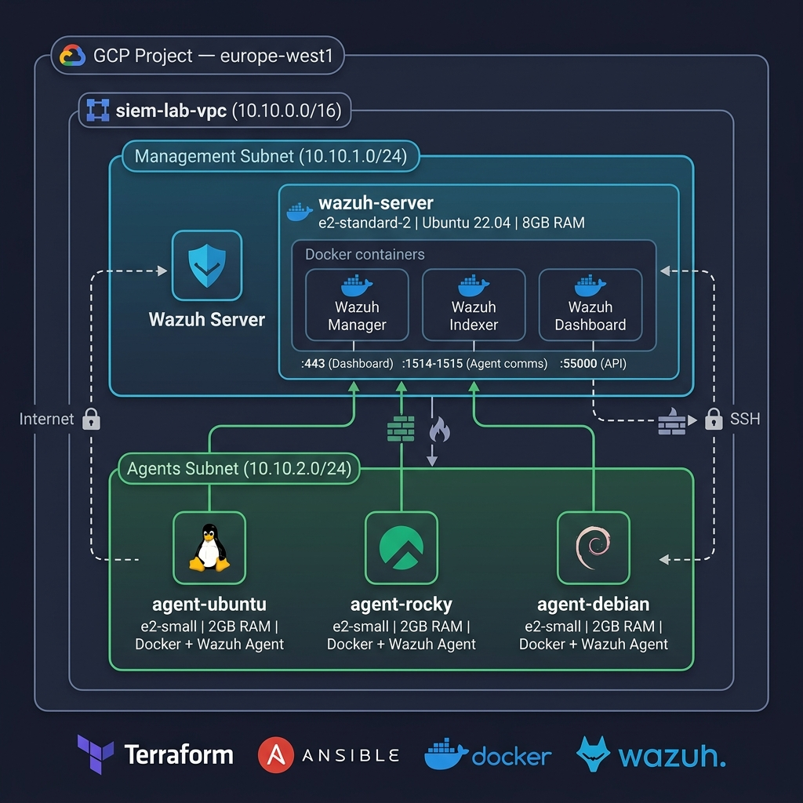
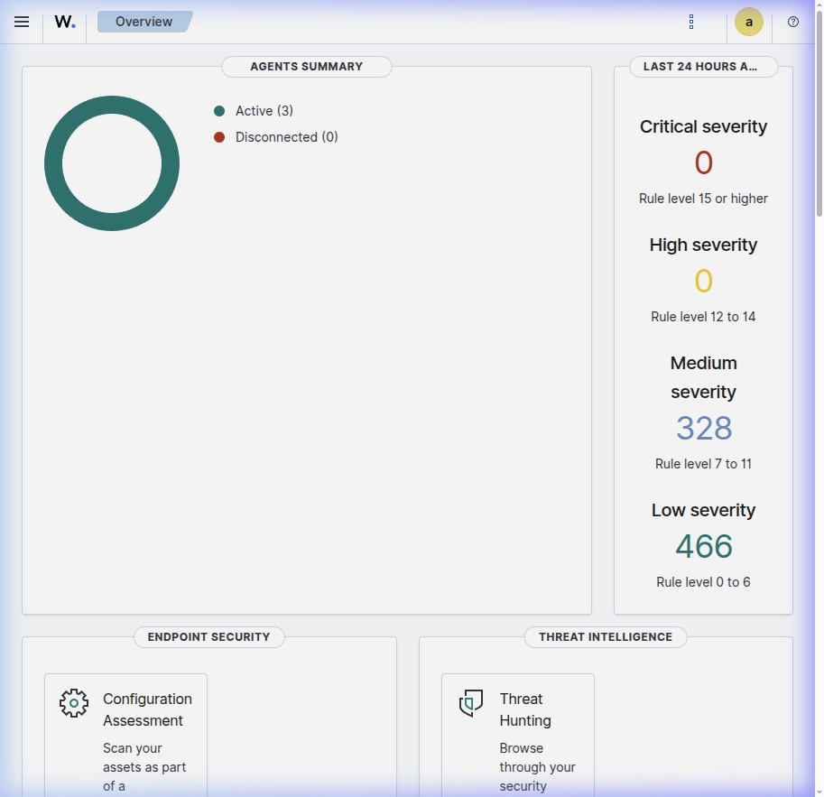
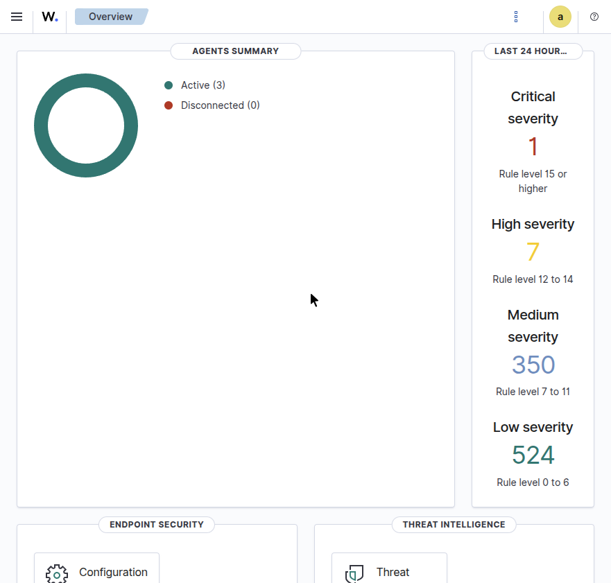
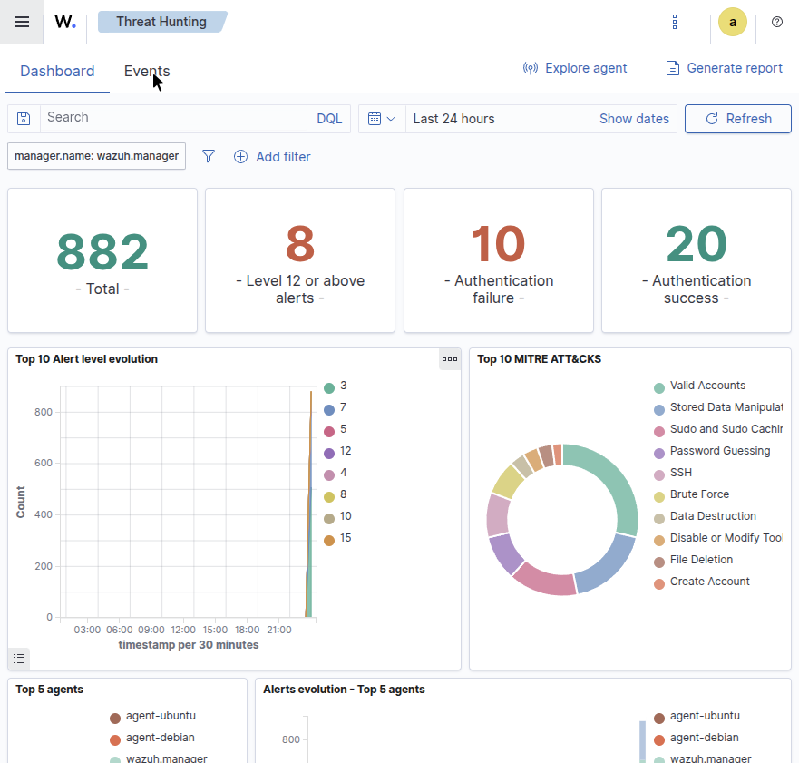
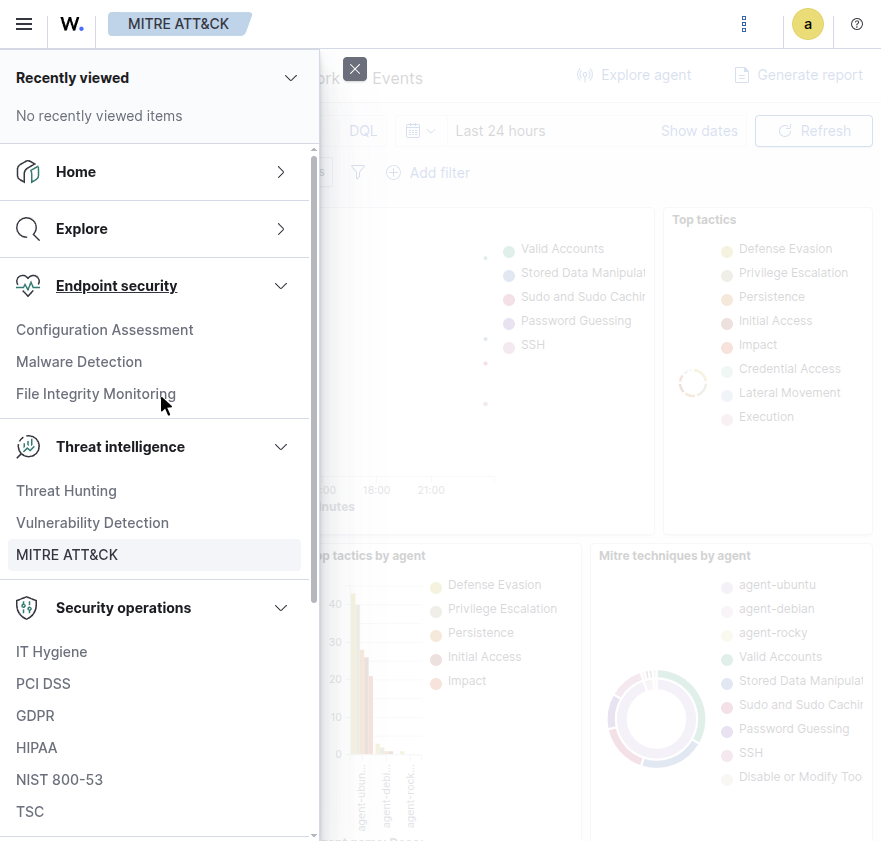
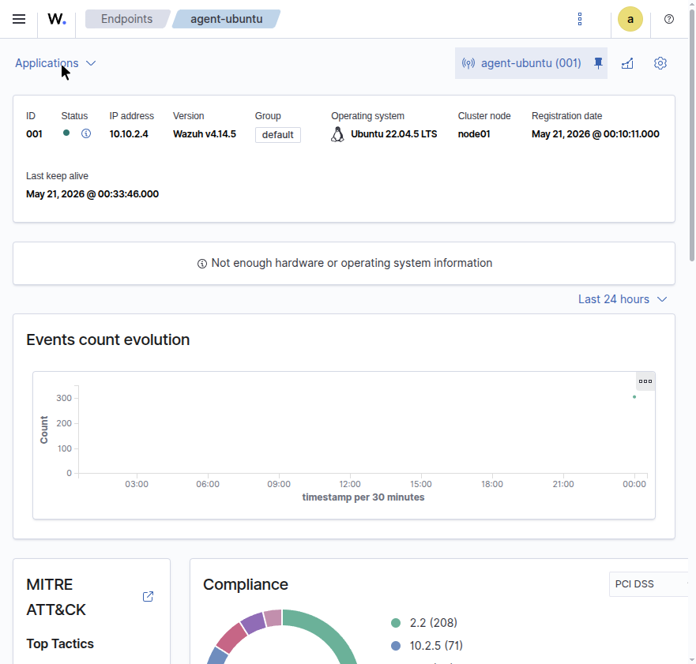
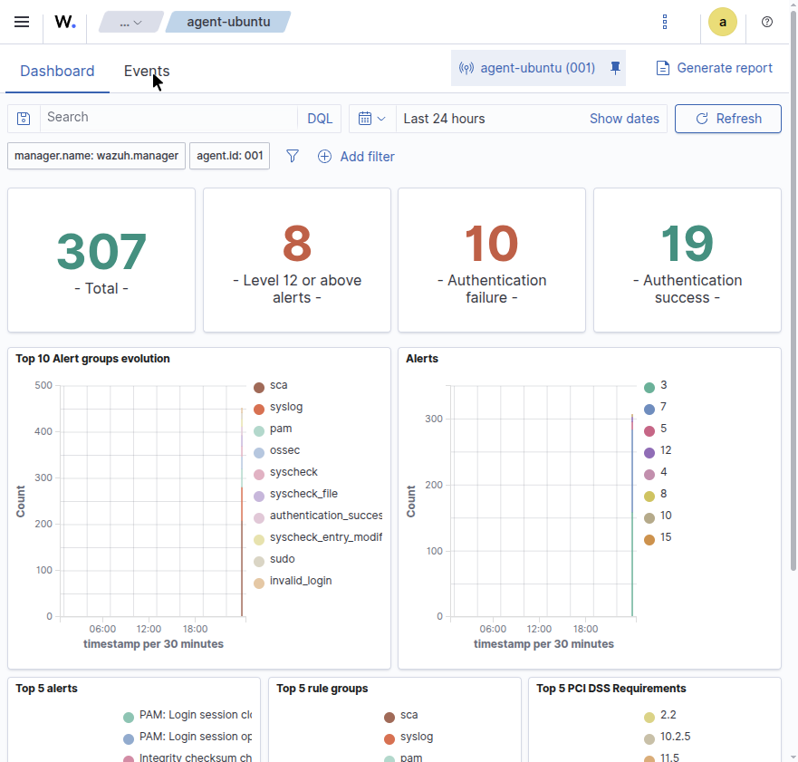

# 🛡️ SIEM Lab on GCP — Infrastructure as Code

[](https://github.com/abdelkader-benaissi/siem-lab/actions/workflows/validate.yml)

> Fully automated SIEM lab environment using **Terraform** + **Ansible** + **Docker** + **Wazuh** on Google Cloud Platform.  
> Deploy a complete Security Operations Center simulation with one command. Tear it down just as fast.

## 🏗️ Architecture

> 📐 **[Open interactive diagram →](docs/architecture.drawio)** *(editable in [draw.io](https://app.diagrams.net/))*



<details>
<summary>Text-based diagram (for accessibility)</summary>

```
GCP Project (europe-west1)
└── VPC: siem-lab-vpc (10.10.0.0/16)
    ├── mgmt-subnet (10.10.1.0/24)
    │   └── 🛡️ wazuh-server (e2-standard-2, 8GB)
    │       ├── Wazuh Manager    :1514-1515
    │       ├── Wazuh Indexer    :9200
    │       └── Wazuh Dashboard  :443
    │
    └── agents-subnet (10.10.2.0/24)
        ├── 🐧 agent-ubuntu  (e2-small, Ubuntu 22.04)
        ├── 🎩 agent-rocky   (e2-small, Rocky Linux 9)
        └── 🐧 agent-debian  (e2-small, Debian 12)
```

</details>


## 📸 Attack Simulation — Before & After

### 🟢 BEFORE Attack — Clean State
> Dashboard overview after fresh deployment. All 3 agents active, **zero critical/high alerts**.



---

### 🔴 AFTER Attack — Threats Detected
> After running `make simulate` with 7 MITRE ATT&CK vectors. Note the jump: **Critical 0→1, High 0→7**.

| Overview — Alert counts spiked | Security Events — Attack patterns visible |
|:---:|:---:|
|  |  |

| MITRE ATT&CK — Technique mapping | Agent Ubuntu — 307 events, spike visible |
|:---:|:---:|
|  |  |

### 📊 Agent Ubuntu — Event Breakdown
> **307 total events**, 8 Level 12+ alerts, 10 auth failures. Clear spikes in syscheck, PAM, sudo, and invalid_login.




## ✨ Features

- **Infrastructure as Code** — Entire environment defined in Terraform with reusable modules
- **Configuration Management** — Ansible roles for Docker, SSH hardening, Wazuh server & agents
- **Multi-OS Support** — Agents deployed on Ubuntu, Rocky Linux, and Debian
- **Network Segmentation** — Separate subnets for management and monitored hosts
- **Security-First Firewall** — Least-privilege rules (SSH restricted, internal-only agent communication)
- **One-Command Workflow** — `make deploy` / `make destroy` for fast lab sessions
- **Attack Simulation** — 7 MITRE ATT&CK techniques to generate real security alerts
- **Custom SOC Dashboard** — 8-panel professional dashboard auto-created via API
- **Cost Optimized** — ~$1 per 8-hour session on GCP free trial credits

## 📋 Prerequisites

- [Terraform](https://www.terraform.io/) >= 1.5.0
- [Ansible](https://www.ansible.com/) >= 2.14
- [Google Cloud SDK](https://cloud.google.com/sdk) (authenticated with `gcloud auth login`)
- GCP project with Compute Engine API enabled
- SSH key pair (default: `~/.ssh/gcp_key`)

## 🚀 Quick Start

```bash
# 1. Clone the repository
git clone https://github.com/abdelkader-benaissi/siem-lab.git
cd siem-lab

# 2. Configure your settings
cp terraform/terraform.tfvars.example terraform/terraform.tfvars
cp terraform/backend.tfbackend.example terraform/backend.tfbackend
# Edit both files with your GCP project ID and state bucket

# 3. Initialize Terraform (first time only)
make setup

# 4. Deploy everything (Terraform + Ansible + Wazuh)
make deploy

# 5. Access the Wazuh Dashboard
make status    # Get the dashboard URL
# Open https://<wazuh-server-ip> in your browser
# Credentials are in: ansible/group_vars/wazuh_server.yml

# 6. Run attack simulation to generate alerts
make simulate       # Target one agent
make simulate-all   # Target all agents

# 7. Create the SOC dashboard
make dashboard

# 8. IMPORTANT: Destroy when done to save credits!
make destroy
```

## 📂 Project Structure

```
siem-lab/
├── Makefile                          # One-command workflow
├── terraform/                        # Infrastructure provisioning
│   ├── main.tf                       # Root module
│   ├── variables.tf / outputs.tf     # Variables and outputs
│   ├── backend.tf                    # Partial backend (GCS)
│   ├── terraform.tfvars.example      # Variable template
│   ├── backend.tfbackend.example     # Backend config template
│   └── modules/
│       ├── network/                  # VPC, subnets, firewall rules
│       └── compute/                  # VM instances (4 VMs)
├── ansible/                          # Configuration management
│   ├── site.yml                      # Master playbook
│   ├── group_vars/                   # Per-group variables
│   └── roles/
│       ├── common/                   # Docker, SSH hardening, packages
│       ├── wazuh_server/             # Wazuh All-in-One deployment
│       └── wazuh_agent/              # Agent install & enrollment
├── scripts/
│   ├── generate-inventory.sh         # Terraform → Ansible bridge
│   ├── attack-simulation.sh          # 7 MITRE ATT&CK attack vectors
│   └── create-dashboard.sh           # Auto-create SOC dashboard
├── docs/
│   ├── architecture.md               # Design decisions
│   ├── architecture.png              # Architecture diagram
│   └── screenshots/                  # Dashboard screenshots
└── .github/workflows/
    └── validate.yml                  # CI: Terraform + Ansible lint
```

## 🛠️ Available Commands

```bash
make setup         # 🔧 First-time Terraform init
make deploy        # 🚀 Full deploy: Terraform + Ansible + Wazuh
make destroy       # 💥 Tear down everything (with confirmation)
make plan          # 📋 Preview infrastructure changes
make configure     # ⚙️  Re-run Ansible only
make ssh-wazuh     # 🔑 SSH into Wazuh server
make status        # 📊 Show VM IPs and connection info
make simulate      # ⚔️  Attack simulation (single agent)
make simulate-all  # ⚔️  Attack simulation (all agents)
make dashboard     # 📊 Create SOC dashboard in Wazuh
make validate      # ✅ Validate Terraform & Ansible syntax
```

## ⚔️ Attack Simulation — MITRE ATT&CK Coverage

| Technique ID | Name | What it triggers |
|:---|:---|:---|
| T1110.001 | Brute Force: Password Guessing | SSH failed login alerts |
| T1565.001 | Data Manipulation: Stored Data | FIM (syscheck) alerts |
| T1078 | Valid Accounts | Sudo/privilege escalation alerts |
| T1059.004 | Unix Shell | Suspicious command execution |
| T1046 | Network Service Scanning | Port scan activity |
| T1053 | Scheduled Task/Job | Cron manipulation alerts |
| T1610 | Deploy Container | Docker activity + privileged container |

## 🔐 Security Features

- **Network Segmentation**: Management and agent VMs on separate subnets
- **Restrictive Firewall**: SSH access limited (configurable CIDR), internal-only agent communication
- **SSH Hardening**: Root login disabled, password auth disabled, key-only access
- **Wazuh Monitoring**: File Integrity Monitoring, rootcheck, SCA, log analysis
- **TLS Encryption**: All Wazuh component communication encrypted
- **No Secrets in Repo**: All credentials and project IDs in `.gitignore`d files

## 🧰 Tech Stack

| Layer | Tools |
|:---|:---|
| Infrastructure | Terraform, GCP Compute Engine |
| Configuration | Ansible (roles-based) |
| Containerization | Docker, Docker Compose |
| SIEM Platform | Wazuh 4.14 (Manager + Indexer + Dashboard) |
| OS | Ubuntu 22.04, Rocky Linux 9, Debian 12 |
| CI/CD | GitHub Actions (validate on push) |


## 📝 License

This project is for educational purposes. Built by [Abdelkader Benaissi](https://abdelkader-benaissi.github.io/).
